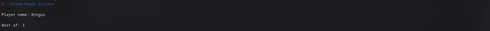
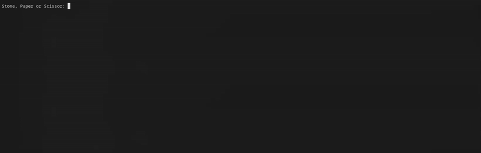
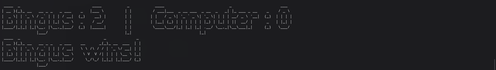

# Stone-Paper-Scissors Game

A command-line implementation of the classic Stone-Paper-Scissors game against a computer, featuring ASCII art displays for moves and a 'best-of' series format. Designed with a retro, typewriter-like visual aesthetic. 

       

  



## Dependencies

To compile and run this game, you will need -

* **A C Compiler:** Such as GCC (GNU Compiler Collection). Needed for compiling C files.
    * **Arch Linux:** `sudo pacman -S gcc`
    * **Debian/Ubuntu:** `sudo apt-get install gcc`
    * **Fedora/RHEL/CentOS:** `sudo dnf install gcc`
    * **macOS:** `xcode-select --install`
* **`figlet` utility -** Displays the final win / loss message.
    * **Arch Linux:** `sudo pacman -S figlet`
    * **Debian/Ubuntu:** `sudo apt install figlet`
    * **Fedora/RHEL/CentOS:** `sudo dnf install figlet`
    * **macOS (Homebrew):** `brew install figlet`

## Installation & Setup

1.  **Clone the repository (or download the source code) -**
    ```bash
    git clone https://github.com/Rithwik-7274/Stone-Paper-Scissors-Game
    cd stone-paper-scissors-game
    ```
    If you've downloaded a `.zip` file, extract it and navigate into the project directory.

2.  **Compile the source code :**
    Open your terminal in the project's directory and run 
    ```bash
    gcc Stone-Paper-Scissors.c -o Stone-Paper-Scissors -std=c11
    ```
    * `-o Stone-Paper-Scissors`: Specifies the output executable name.
    * `-std=c11`: Compiles the code using the C11 standard.

## How to Play

1.  **Run the executable -**
    ```bash
    ./Stone-Paper-Scissors
    ```

2.  **Enter your player name:**
    The game will prompt you to enter your player name.

3.  **Choose 'Best-of' series:**
    You'll then be asked to enter a **positive odd** integer for the 'Best-of' series (e.g., 3 for best of 3, 5 for best of 5).

4.  **Make your choice:**
    For each round, you'll be prompted to enter "Stone", "Paper", or "Scissors". Type your choice(Inputs are case-insensitive) and press Enter. The game will display the moves with ASCII art and update the scores.

5.  **Test your luck:**
    The game continues until you or the computer reaches the required number of wins for the 'best-of' series. The final result will be displayed using `figlet`.

## Project Structure 

* `Stone-Paper-Scissors.c`: The main source file containing all game logic, ASCII art definitions, and function implementations.
* `Doxyfile`: The configuration file for Doxygen, used to generate API documentation.
* `README.md`: This file.
* `LICENSE`: Contains the license used for the project.
* `Images/`: Contains visuals used in README.md

## Doxygen Documentation

This project's code is thoroughly documented using Doxygen. You can generate and view the API documentation yourself:

1.  **Ensure Doxygen is installed -**
    * **Arch Linux:** `sudo pacman -S doxygen graphviz`
    * **Debian/Ubuntu:** `sudo apt install doxygen graphviz`
    * **Fedora/RHEL/CentOS:** `sudo dnf install doxygen graphviz`
    * **macOS (Homebrew):** `brew install doxygen graphviz` 

2.  **Navigate to the project directory and run Doxygen -**
    ```bash
    cd /path/to/the/repository
    doxygen
    ```
5.  **View the documentation:**
    Open `docs/html/index.html`.

## Credits

Images were obtained from the sources below and converted to ascii art using [jp2a](https://github.com/cslarsen/jp2a).

* **Stone:** https://www.rawpixel.com/image/6791655
* **Scissors:** <a href="https://www.flaticon.com/free-icons/scissor" title="scissor icons">Scissor icons created by Icongeek26 - Flaticon</a>
* **Paper:** https://icon-icons.com/icon/document-duplicate-page-paper/124766
* **VS icon:** https://openclipart.org/detail/349242/versus-pictogram

*Overall project assistance was provided by Gemini.*

## License

This project is licensed under the **GPL-3.0-or-later** license. See the `LICENSE` file for the full license text.

## Author

**Rithwik A. Agarwal**

